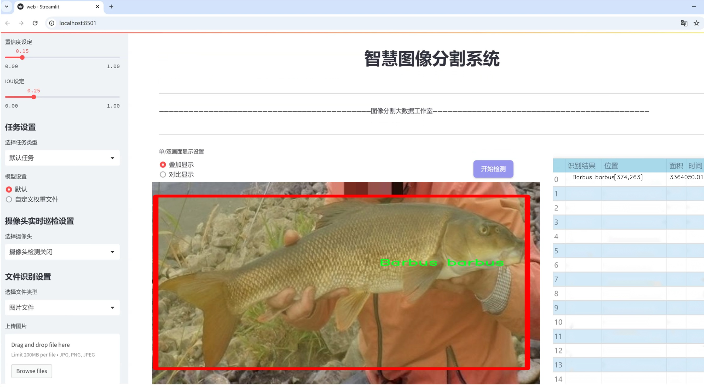
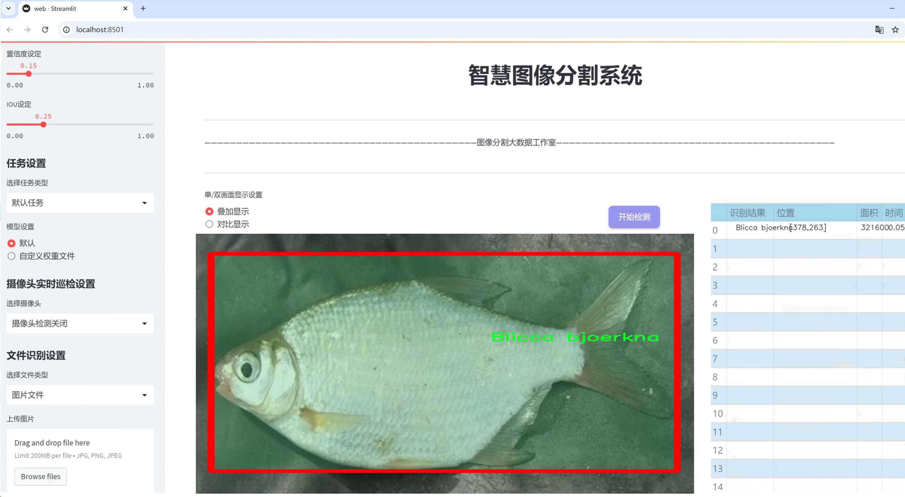
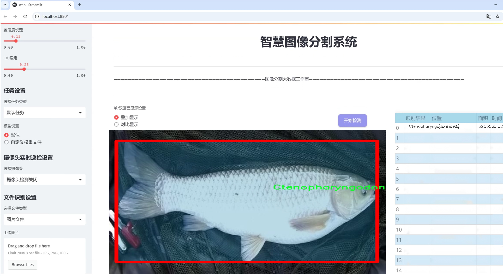
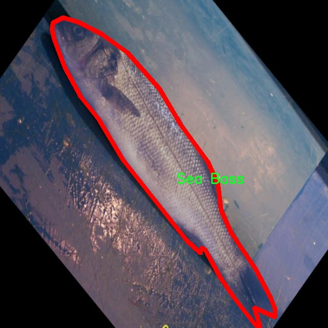
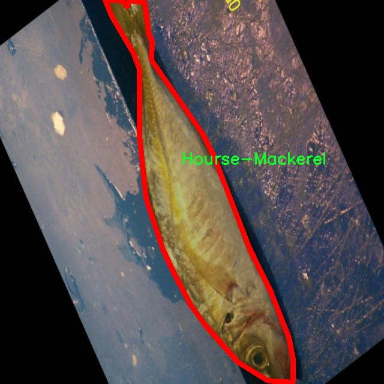
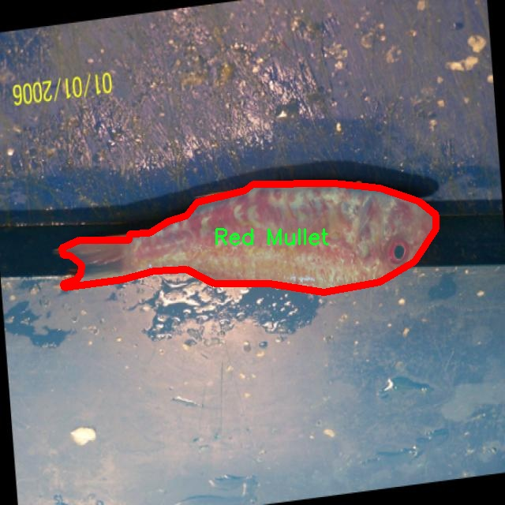
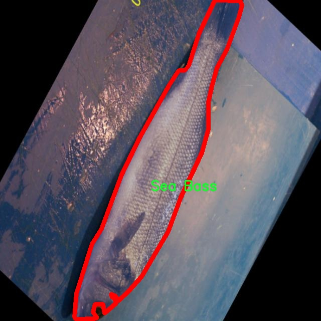
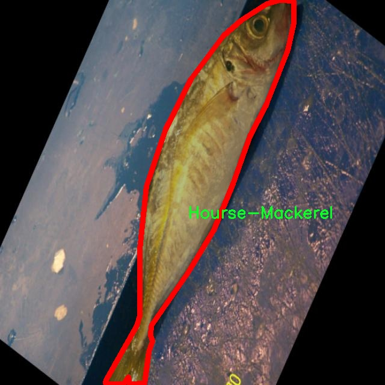

# 水族馆鱼类分割系统源码＆数据集分享
 [yolov8-seg-LSKNet＆yolov8-seg-dyhead-DCNV3等50+全套改进创新点发刊_一键训练教程_Web前端展示]

### 1.研究背景与意义

项目参考[ILSVRC ImageNet Large Scale Visual Recognition Challenge](https://gitee.com/YOLOv8_YOLOv11_Segmentation_Studio/projects)

项目来源[AAAI Global Al lnnovation Contest](https://kdocs.cn/l/cszuIiCKVNis)

研究背景与意义

随着人工智能技术的迅猛发展，计算机视觉在多个领域的应用逐渐深入，尤其是在生物多样性保护和生态监测方面。水族馆作为展示水生生物的重要场所，不仅是公众了解水生生态的重要窗口，也是科学研究和教育的重要基地。然而，传统的水族馆鱼类监测方法往往依赖人工观察，效率低下且容易受到人为因素的影响。因此，基于深度学习的自动化鱼类分割系统应运而生，成为提升水族馆鱼类监测效率和准确性的有效工具。

本研究旨在基于改进的YOLOv8模型，构建一个高效的水族馆鱼类分割系统。YOLO（You Only Look Once）系列模型因其高效的实时检测能力而广受欢迎，然而，针对水族馆环境中的鱼类分割任务，传统YOLO模型在处理复杂背景和多类鱼类时仍存在一定的局限性。因此，改进YOLOv8模型以适应水族馆特定场景的需求，具有重要的研究价值和实际意义。

本研究所使用的数据集“水族馆 - NASA空间”包含7200张图像，涵盖34种不同类别的鱼类，包括常见的淡水鱼和海水鱼。这一丰富的数据集为模型的训练和验证提供了坚实的基础，能够有效提高模型在多样化场景下的泛化能力。通过对这些图像进行实例分割，研究将实现对水族馆中不同鱼类的精准识别和定位，为后续的生态监测和数据分析提供支持。

鱼类分割系统的建立不仅能够提升水族馆内鱼类监测的自动化水平，还将为科学研究提供重要的数据支持。通过对鱼类种群的动态监测，研究人员可以更好地了解水族馆生态系统的健康状况，评估不同环境因素对鱼类生长和行为的影响。此外，该系统还可以应用于水族馆的教育和宣传活动，帮助公众更直观地了解水生生物的多样性和生态价值，增强公众的环保意识。

在全球面临生物多样性下降和生态环境恶化的背景下，水族馆作为生态保护的重要参与者，其鱼类监测和管理的科学化、智能化显得尤为重要。本研究通过改进YOLOv8模型，推动水族馆鱼类分割技术的发展，旨在为水族馆的可持续发展提供技术支持，同时为生物多样性保护贡献一份力量。综上所述，本研究不仅具有重要的学术价值，也具备广泛的社会意义，期待能够为水族馆管理和生态保护领域带来新的思路和方法。

### 2.图片演示







##### 注意：由于此博客编辑较早，上面“2.图片演示”和“3.视频演示”展示的系统图片或者视频可能为老版本，新版本在老版本的基础上升级如下：（实际效果以升级的新版本为准）

  （1）适配了YOLOV8的“目标检测”模型和“实例分割”模型，通过加载相应的权重（.pt）文件即可自适应加载模型。

  （2）支持“图片识别”、“视频识别”、“摄像头实时识别”三种识别模式。

  （3）支持“图片识别”、“视频识别”、“摄像头实时识别”三种识别结果保存导出，解决手动导出（容易卡顿出现爆内存）存在的问题，识别完自动保存结果并导出到tempDir中。

  （4）支持Web前端系统中的标题、背景图等自定义修改，后面提供修改教程。

  另外本项目提供训练的数据集和训练教程,暂不提供权重文件（best.pt）,需要您按照教程进行训练后实现图片演示和Web前端界面演示的效果。

### 3.视频演示

[3.1 视频演示](https://www.bilibili.com/video/BV1Kx1BYzEXr/)

### 4.数据集信息展示

##### 4.1 本项目数据集详细数据（类别数＆类别名）

nc: 33
names: ['Abramis brama', 'Acipenseridae', 'Anguilla anguilla', 'Aspius aspius', 'Barbus barbus', 'Blicca bjoerkna', 'Carassius carassius', 'Carassius gibelio', 'Ctenopharyngodon idella', 'Cyprinus carpio', 'Esox lucius', 'Gasterosteus aculeatus', 'Gobio gobio', 'Gymnocephalus cernuus', 'Hourse-Mackerel', 'Lepomis gibbosus', 'Leuciscus cephalus', 'Leuciscus idus', 'Leuciscus leuciscus', 'Neogobius fluviatilis', 'Neogobius kessleri', 'Neogobius melanostomus', 'Perca fluviatilis', 'Red Mullet', 'Red Sea Bream', 'Rhodeus amarus', 'Rutilus rutilus', 'Scardinius erythrophthalmus', 'Sea Bass', 'Silurus glanis', 'Tinca tinca', 'Vimba vimba', 'starfish']


##### 4.2 本项目数据集信息介绍

数据集信息展示

在本研究中，我们使用了名为“Aquarium - Nasa Space”的数据集，以训练和改进YOLOv8-seg模型，旨在实现水族馆鱼类的高效分割。该数据集包含33个不同的鱼类类别，涵盖了广泛的水生生物，适用于多种视觉识别和分割任务。每个类别的鱼类不仅在外观上各具特色，而且在生态习性和栖息环境上也有显著差异，这为模型的训练提供了丰富的多样性。

数据集中包含的鱼类类别包括了常见的淡水鱼和海水鱼，例如“Abramis brama”、“Cyprinus carpio”和“Esox lucius”等，这些鱼类在水族馆中常见，且具有重要的生态和经济价值。通过对这些鱼类的精确分割，模型能够更好地理解和识别不同鱼类的特征，从而提高分割的准确性和鲁棒性。此外，数据集中还包括了一些较为特殊的物种，如“Anguilla anguilla”和“Silurus glanis”，这些鱼类的形态特征各异，为模型提供了更具挑战性的分割任务。

值得注意的是，数据集中的类别列表还包括了“starfish”，这不仅丰富了数据集的多样性，也为模型的训练增加了新的维度。通过对不同类别的鱼类及其他水生生物进行标注和分割，模型将能够学习到更为复杂的特征和模式，从而提升其在实际应用中的表现。

数据集的构建过程遵循严格的标准，确保每个类别的样本数量和质量都达到一定的要求。这一过程不仅包括对鱼类的图像采集，还涉及到对图像进行标注，以确保每个样本都能准确反映出鱼类的特征。通过高质量的标注，模型能够在训练过程中有效地学习到每个类别的独特性，从而在分割任务中表现出色。

在数据集的使用过程中，我们将采用数据增强技术，以提高模型的泛化能力。这包括对图像进行旋转、缩放、翻转等操作，模拟不同的观察角度和环境条件，使模型能够在多样化的场景中进行有效的识别和分割。通过这种方式，我们希望能够提升模型在实际应用中的适应性，确保其在面对不同水族馆环境时仍能保持高效的分割性能。

总之，“Aquarium - Nasa Space”数据集为我们提供了一个丰富而多样的基础，支持我们在水族馆鱼类分割领域的研究与探索。通过对33个鱼类类别的深入学习和分析，我们期望能够推动YOLOv8-seg模型的改进，最终实现更加精准和高效的水族馆鱼类分割系统。这不仅有助于水族馆的管理和研究，也为生态保护和生物多样性研究提供了重要的数据支持。











### 5.全套项目环境部署视频教程（零基础手把手教学）

[5.1 环境部署教程链接（零基础手把手教学）](https://www.bilibili.com/video/BV1jG4Ve4E9t/?vd_source=bc9aec86d164b67a7004b996143742dc)


[5.2 安装Python虚拟环境创建和依赖库安装视频教程链接（零基础手把手教学）](https://www.bilibili.com/video/BV1nA4VeYEze/?vd_source=bc9aec86d164b67a7004b996143742dc)

### 6.手把手YOLOV8-seg训练视频教程（零基础小白有手就能学会）

[6.1 手把手YOLOV8-seg训练视频教程（零基础小白有手就能学会）](https://www.bilibili.com/video/BV1cA4VeYETe/?vd_source=bc9aec86d164b67a7004b996143742dc)


按照上面的训练视频教程链接加载项目提供的数据集，运行train.py即可开始训练



     Epoch   gpu_mem       box       obj       cls    labels  img_size
     1/200     0G   0.01576   0.01955  0.007536        22      1280: 100%|██████████| 849/849 [14:42<00:00,  1.04s/it]
               Class     Images     Labels          P          R     mAP@.5 mAP@.5:.95: 100%|██████████| 213/213 [01:14<00:00,  2.87it/s]
                 all       3395      17314      0.994      0.957      0.0957      0.0843

     Epoch   gpu_mem       box       obj       cls    labels  img_size
     2/200     0G   0.01578   0.01923  0.007006        22      1280: 100%|██████████| 849/849 [14:44<00:00,  1.04s/it]
               Class     Images     Labels          P          R     mAP@.5 mAP@.5:.95: 100%|██████████| 213/213 [01:12<00:00,  2.95it/s]
                 all       3395      17314      0.996      0.956      0.0957      0.0845

     Epoch   gpu_mem       box       obj       cls    labels  img_size
     3/200     0G   0.01561    0.0191  0.006895        27      1280: 100%|██████████| 849/849 [10:56<00:00,  1.29it/s]
               Class     Images     Labels          P          R     mAP@.5 mAP@.5:.95: 100%|███████   | 187/213 [00:52<00:00,  4.04it/s]
                 all       3395      17314      0.996      0.957      0.0957      0.0845


### 7.50+种全套YOLOV8-seg创新点代码加载调参视频教程（一键加载写好的改进模型的配置文件）

[7.1 50+种全套YOLOV8-seg创新点代码加载调参视频教程（一键加载写好的改进模型的配置文件）](https://www.bilibili.com/video/BV1Hw4VePEXv/?vd_source=bc9aec86d164b67a7004b996143742dc)

### 8.YOLOV8-seg图像分割算法原理

原始YOLOV8-seg算法原理

YOLOv8-seg算法是YOLO系列算法的最新进展，标志着目标检测和实例分割领域的一次重要技术革新。作为一种单阶段检测算法，YOLOv8不仅在检测精度上取得了显著提升，同时在检测速度方面也表现出色，成为计算机视觉领域的佼佼者。YOLOv8的架构设计经过精心优化，主要由输入模块、Backbone骨干网络、Neck特征融合网络和Head检测模块四个部分组成。每个模块的设计都旨在提升模型的整体性能，确保在复杂环境下的高效识别和分割能力。

在输入模块中，YOLOv8首先对输入图像进行预处理，包括调整图像比例、实现Mosaic增强以及瞄点计算等操作。这些预处理步骤旨在增强图像的多样性，提高模型的泛化能力。Mosaic增强技术通过将多张图像拼接成一张新图像，增加了训练样本的多样性，使得模型在面对不同场景时能够更好地适应。

YOLOv8的Backbone骨干网络采用了DarkNet结构，但在此基础上进行了重要的改进。传统的C3模块被C2f模块所替代，C2f模块通过引入更多的跳层连接和Split操作，增强了特征提取的能力。这种设计不仅保留了轻量级特性，还提高了梯度流动的效率，使得网络能够更好地捕捉到不同尺度的特征信息。此外，Backbone中的SPPF模块通过对输出特征图进行多尺度池化处理，进一步增强了特征图的表达能力，为后续的特征融合奠定了基础。

在Neck特征融合网络中，YOLOv8依然采用了“双塔结构”，结合了特征金字塔和路径聚合网络。这种结构的设计使得语义特征和定位特征能够有效地转移和融合，增强了网络对不同尺度目标的检测能力。通过这种特征融合机制，YOLOv8能够在复杂场景中更准确地识别和分割目标，提升了整体的检测性能。

YOLOv8的Head检测模块是其创新的核心所在。与之前的YOLO版本不同，YOLOv8采用了解耦头的结构，将回归分支和预测分支进行分离。这一设计显著加速了模型的收敛速度，并提高了检测的精度。此外，YOLOv8引入了Anchor-Free的检测方式，摒弃了传统的Anchor-Based方法，使得模型在处理小目标和高分辨率图像时表现得更加灵活和高效。

YOLOv8-seg算法的另一个重要创新是其损失函数的设计。通过优化损失函数，YOLOv8-seg能够更好地平衡分类和回归任务的权重，从而提升模型在复杂场景下的分割精度。这一创新使得YOLOv8-seg在实例分割任务中表现出色，能够准确地分割出目标物体的边界，并有效地处理重叠和遮挡的情况。

在实际应用中，YOLOv8-seg算法展现出了强大的适应性和灵活性。无论是在垃圾分类、自动驾驶、医疗影像分析还是视频监控等领域，YOLOv8-seg都能够快速、准确地完成目标检测和实例分割任务。其高效的计算性能和优异的检测精度，使得YOLOv8-seg成为了许多实际应用中的首选方案。

总的来说，YOLOv8-seg算法通过对网络结构的深度优化和创新设计，极大地提升了目标检测和实例分割的性能。其在输入处理、特征提取、特征融合和检测模块等方面的改进，使得YOLOv8-seg不仅能够高效地处理复杂场景中的目标，还能够在不同硬件平台上实现快速推理。这些特性使得YOLOv8-seg在计算机视觉领域中占据了重要的地位，推动了目标检测和实例分割技术的进一步发展。随着YOLOv8-seg的不断完善和应用推广，我们有理由相信，它将在未来的研究和应用中发挥更加重要的作用。


### 9.系统功能展示（检测对象为举例，实际内容以本项目数据集为准）

图9.1.系统支持检测结果表格显示

  图9.2.系统支持置信度和IOU阈值手动调节

  图9.3.系统支持自定义加载权重文件best.pt(需要你通过步骤5中训练获得)

  图9.4.系统支持摄像头实时识别

  图9.5.系统支持图片识别

  图9.6.系统支持视频识别

  图9.7.系统支持识别结果文件自动保存

  图9.8.系统支持Excel导出检测结果数据


### 10.50+种全套YOLOV8-seg创新点原理讲解（非科班也可以轻松写刊发刊，V11版本正在科研待更新）

#### 10.1 由于篇幅限制，每个创新点的具体原理讲解就不一一展开，具体见下列网址中的创新点对应子项目的技术原理博客网址【Blog】：


[10.1 50+种全套YOLOV8-seg创新点原理讲解链接](https://gitee.com/qunmasj/good)

#### 10.2 部分改进模块原理讲解(完整的改进原理见上图和技术博客链接)
### CBAM空间注意力机制
近年来，随着深度学习研究方向的火热，注意力机制也被广泛地应用在图像识别、语音识别和自然语言处理等领域，注意力机制在深度学习任务中发挥着举足轻重的作用。注意力机制借鉴于人类的视觉系统，例如，人眼在看到一幅画面时，会倾向于关注画面中的重要信息，而忽略其他可见的信息。深度学习中的注意力机制和人类视觉的注意力机制相似，通过扫描全局数据，从大量数据中选择出需要重点关注的、对当前任务更为重要的信息，然后对这部分信息分配更多的注意力资源，从这些信息中获取更多所需要的细节信息，而抑制其他无用的信息。而在深度学习中，则具体表现为给感兴趣的区域更高的权重，经过网络的学习和调整，得到最优的权重分配，形成网络模型的注意力，使网络拥有更强的学习能力，加快网络的收敛速度。
注意力机制通常可分为软注意力机制和硬注意力机制[4-5]。软注意力机制在选择信息时，不是从输入的信息中只选择1个，而会用到所有输入信息，只是各个信息对应的权重分配不同，然后输入网络模型进行计算;硬注意力机制则是从输入的信息中随机选取一个或者选择概率最高的信息，但是这一步骤通常是不可微的，导致硬注意力机制更难训练。因此，软注意力机制应用更为广泛，按照原理可将软注意力机制划分为:通道注意力机制（channel attention)、空间注意力机制(spatial attention）和混合域注意力机制(mixed attention)。
通道注意力机制的本质建立各个特征通道之间的重要程度，对感兴趣的通道进行重点关注，弱化不感兴趣的通道的作用;空间注意力的本质则是建模了整个空间信息的重要程度，然后对空间内感兴趣的区域进行重点关注，弱化其余非感兴趣区域的作用;混合注意力同时运用了通道注意力和空间注意力，两部分先后进行或并行，形成对通道特征和空间特征同时关注的注意力模型。

卷积层注意力模块(Convolutional Block Attention Module，CBAM）是比较常用的混合注意力模块，其先后集中了通道注意力模块和空间注意力模块，网络中加入该模块能有效提高网络性能，减少网络模型的计算量，模块结构如图所示。输入特征图首先经过分支的通道注意力模块，然后和主干的原特征图融合，得到具有通道注意力的特征图，接着经过分支的空间注意力模块，在和主干的特征图融合后，得到同时具有通道特征注意力和空间特征注意力的特征图。CBAM模块不改变输入特征图的大小，因此该模块是一个“即插即用”的模块，可以插入网络的任何位置。

通道注意力模块的结构示意图如图所示，通道注意力模块分支并行地对输入的特征图进行最大池化操作和平均池化操作，然后利用多层感知机对结果进行变换，得到应用于两个通道的变换结果，最后经过sigmoid激活函数将变换结果融合，得到具有通道注意力的通道特征图。

空间注意力模块示意图如图所示，将通道注意力模块输出的特征图作为该模块的输入特征图，首先对输入特征图进行基于通道的最大池化操作和平均池化操作，将两部分得到的结果拼接起来，然后通过卷积得到降为Ⅰ通道的特征图，最后通过sigmoid激活函数生成具有空间注意力的特征图。


### 11.项目核心源码讲解（再也不用担心看不懂代码逻辑）

#### 11.1 ui.py

以下是经过简化和注释的核心代码部分：

```python
import sys
import subprocess

def run_script(script_path):
    """
    使用当前 Python 环境运行指定的脚本。

    Args:
        script_path (str): 要运行的脚本路径
    """
    # 获取当前 Python 解释器的路径
    python_path = sys.executable

    # 构建运行命令，使用 streamlit 运行指定的脚本
    command = f'"{python_path}" -m streamlit run "{script_path}"'

    # 执行命令，并检查返回结果
    result = subprocess.run(command, shell=True)
    if result.returncode != 0:
        print("脚本运行出错。")

# 主程序入口
if __name__ == "__main__":
    # 指定要运行的脚本路径
    script_path = "web.py"  # 假设脚本在当前目录下

    # 调用函数运行脚本
    run_script(script_path)
```

### 代码分析与注释：

1. **导入模块**：
   - `sys`：用于访问与 Python 解释器相关的变量和函数。
   - `subprocess`：用于执行外部命令。

2. **定义 `run_script` 函数**：
   - 此函数接收一个脚本路径作为参数，并在当前 Python 环境中运行该脚本。
   - 使用 `sys.executable` 获取当前 Python 解释器的路径，以确保使用正确的 Python 环境。

3. **构建命令**：
   - 使用 f-string 构建命令字符串，调用 `streamlit` 运行指定的脚本。

4. **执行命令**：
   - 使用 `subprocess.run` 执行构建的命令，并通过 `shell=True` 允许在 shell 中执行。
   - 检查命令的返回码，如果不为 0，表示脚本运行出错，打印错误信息。

5. **主程序入口**：
   - 通过 `if __name__ == "__main__":` 确保只有在直接运行该脚本时才会执行以下代码。
   - 指定要运行的脚本路径（这里假设为 `web.py`）。
   - 调用 `run_script` 函数来运行指定的脚本。 

这样，代码的核心功能得以保留，并且通过详细的注释，便于理解每个部分的作用。

这个文件名为 `ui.py`，它的主要功能是通过当前的 Python 环境来运行一个指定的脚本。文件中首先导入了几个必要的模块，包括 `sys`、`os` 和 `subprocess`，这些模块分别用于获取系统信息、处理文件路径和执行外部命令。

在文件的开头，定义了一个名为 `run_script` 的函数，该函数接受一个参数 `script_path`，表示要运行的脚本的路径。函数内部首先获取当前 Python 解释器的路径，这样可以确保在正确的环境中运行脚本。接着，构建一个命令字符串，该命令使用 `streamlit` 模块来运行指定的脚本。`streamlit` 是一个用于构建数据应用的框架。

使用 `subprocess.run` 方法执行构建好的命令，这个方法会在新的 shell 中运行命令，并等待其完成。执行完后，检查返回码，如果返回码不为零，表示脚本运行出错，程序会输出一条错误信息。

在文件的最后部分，使用 `if __name__ == "__main__":` 语句来确保只有在直接运行该文件时才会执行以下代码。这部分代码指定了要运行的脚本路径，这里使用了 `abs_path` 函数来获取 `web.py` 文件的绝对路径。然后调用 `run_script` 函数来运行这个脚本。

总的来说，这个文件的作用是为一个 Streamlit 应用提供一个启动脚本，方便用户在当前 Python 环境中运行指定的 `web.py` 脚本。

#### 11.2 demo_test_image.py

以下是代码中最核心的部分，并附上详细的中文注释：

```python
import cv2
import numpy as np
from PIL import ImageFont, ImageDraw, Image
from hashlib import md5
from model import Web_Detector
from chinese_name_list import Label_list

def generate_color_based_on_name(name):
    # 使用哈希函数生成稳定的颜色
    hash_object = md5(name.encode())  # 对名字进行MD5哈希
    hex_color = hash_object.hexdigest()[:6]  # 取前6位16进制数作为颜色值
    r, g, b = int(hex_color[0:2], 16), int(hex_color[2:4], 16), int(hex_color[4:6], 16)  # 转换为RGB
    return (b, g, r)  # OpenCV 使用BGR格式

def draw_with_chinese(image, text, position, font_size=20, color=(255, 0, 0)):
    # 在图像上绘制中文文本
    image_pil = Image.fromarray(cv2.cvtColor(image, cv2.COLOR_BGR2RGB))  # 转换为PIL格式
    draw = ImageDraw.Draw(image_pil)  # 创建绘图对象
    font = ImageFont.truetype("simsun.ttc", font_size, encoding="unic")  # 加载中文字体
    draw.text(position, text, font=font, fill=color)  # 绘制文本
    return cv2.cvtColor(np.array(image_pil), cv2.COLOR_RGB2BGR)  # 转换回OpenCV格式

def draw_detections(image, info):
    # 绘制检测结果，包括边框、类别名称等
    name, bbox = info['class_name'], info['bbox']  # 获取类别名称和边框
    x1, y1, x2, y2 = bbox  # 解包边框坐标
    cv2.rectangle(image, (x1, y1), (x2, y2), color=(0, 0, 255), thickness=3)  # 绘制边框
    image = draw_with_chinese(image, name, (x1, y1 - 10), font_size=20)  # 绘制类别名称
    return image

def process_frame(model, image):
    # 处理图像帧，进行目标检测
    pre_img = model.preprocess(image)  # 预处理图像
    pred = model.predict(pre_img)  # 进行预测
    det = pred[0]  # 获取检测结果

    if det is not None and len(det):
        det_info = model.postprocess(pred)  # 后处理，获取检测信息
        for info in det_info:
            image = draw_detections(image, info)  # 绘制检测结果
    return image

if __name__ == "__main__":
    model = Web_Detector()  # 初始化模型
    model.load_model("./weights/yolov8s-seg.pt")  # 加载模型权重

    # 图片处理
    image_path = './icon/OIP.jpg'  # 指定图片路径
    image = cv2.imread(image_path)  # 读取图片
    if image is not None:
        processed_image = process_frame(model, image)  # 处理图像
        cv2.imshow('Processed Image', processed_image)  # 显示处理后的图像
        cv2.waitKey(0)  # 等待按键
        cv2.destroyAllWindows()  # 关闭窗口
    else:
        print('Image not found.')  # 图片未找到的提示
```

### 代码核心部分说明：
1. **生成颜色**：`generate_color_based_on_name` 函数通过对名称进行哈希，生成一个稳定的颜色值，以便在绘制时使用。
2. **绘制中文文本**：`draw_with_chinese` 函数用于在图像上绘制中文文本，使用PIL库处理中文字体。
3. **绘制检测结果**：`draw_detections` 函数负责在图像上绘制检测到的物体的边框和类别名称。
4. **处理图像帧**：`process_frame` 函数对输入图像进行预处理、预测和后处理，最终返回绘制了检测结果的图像。
5. **主程序**：在主程序中，加载模型并读取图像，处理后显示结果。

这个程序文件 `demo_test_image.py` 是一个用于图像处理和目标检测的 Python 脚本，主要依赖于 OpenCV 和其他图像处理库。程序的核心功能是加载一张图片，使用深度学习模型进行目标检测，并在图像上绘制检测到的目标的边界框、类别名称及相关信息。

首先，程序导入了一些必要的库，包括 `random`、`cv2`（OpenCV）、`numpy`、`PIL`（用于处理图像的库）、`hashlib`（用于生成哈希值）以及自定义的 `Web_Detector` 模型和 `Label_list` 类别名称列表。

程序定义了几个辅助函数。`generate_color_based_on_name` 函数使用 MD5 哈希算法根据目标名称生成一个稳定的颜色值，以便在图像中标识不同的目标。`calculate_polygon_area` 函数计算给定点的多边形面积，`draw_with_chinese` 函数则用于在图像上绘制中文文本，支持设置字体大小和颜色。

`adjust_parameter` 函数根据图像的大小调整参数，以便在不同分辨率的图像上保持一致的视觉效果。`draw_detections` 函数是程序的核心部分，负责在图像上绘制检测到的目标。它会根据目标的边界框或掩膜绘制矩形或多边形，并计算目标的面积、周长和圆度等信息，同时在图像上显示这些信息。

`process_frame` 函数用于处理每一帧图像。它首先对图像进行预处理，然后使用模型进行预测，最后调用 `draw_detections` 函数在图像上绘制检测结果。

在 `__main__` 部分，程序首先加载目标检测模型，然后读取指定路径的图像。如果图像成功加载，程序将调用 `process_frame` 函数处理图像，并通过 OpenCV 显示处理后的图像。如果图像未找到，则输出相应的错误信息。

整体而言，这个程序实现了一个完整的目标检测流程，从加载模型、读取图像到处理和显示结果，适合用于图像分析和计算机视觉相关的应用。

#### 11.3 ultralytics\models\yolo\pose\val.py

以下是经过简化并添加详细中文注释的核心代码部分：

```python
from ultralytics.models.yolo.detect import DetectionValidator
from ultralytics.utils import ops
from ultralytics.utils.metrics import PoseMetrics, box_iou, kpt_iou

class PoseValidator(DetectionValidator):
    """
    PoseValidator类，继承自DetectionValidator，用于基于姿态模型的验证。
    """

    def __init__(self, dataloader=None, save_dir=None, args=None):
        """初始化PoseValidator对象，设置相关参数和属性。"""
        super().__init__(dataloader, save_dir, args=args)
        self.kpt_shape = None  # 关键点形状
        self.args.task = 'pose'  # 设置任务类型为姿态估计
        self.metrics = PoseMetrics(save_dir=self.save_dir)  # 初始化姿态度量

    def preprocess(self, batch):
        """预处理批次数据，将关键点数据转换为浮点数并移动到设备上。"""
        batch = super().preprocess(batch)  # 调用父类的预处理方法
        batch['keypoints'] = batch['keypoints'].to(self.device).float()  # 转换关键点为浮点数
        return batch

    def postprocess(self, preds):
        """应用非极大值抑制，返回高置信度的检测结果。"""
        return ops.non_max_suppression(preds, self.args.conf, self.args.iou)

    def init_metrics(self, model):
        """初始化YOLO模型的姿态估计度量。"""
        super().init_metrics(model)  # 调用父类的初始化方法
        self.kpt_shape = self.data['kpt_shape']  # 获取关键点形状
        is_pose = self.kpt_shape == [17, 3]  # 判断是否为姿态估计
        nkpt = self.kpt_shape[0]  # 关键点数量
        self.sigma = np.ones(nkpt) / nkpt if not is_pose else OKS_SIGMA  # 设置sigma值

    def update_metrics(self, preds, batch):
        """更新度量指标。"""
        for si, pred in enumerate(preds):  # 遍历每个预测结果
            idx = batch['batch_idx'] == si  # 获取当前批次索引
            cls = batch['cls'][idx]  # 获取当前批次的类别
            bbox = batch['bboxes'][idx]  # 获取当前批次的边界框
            kpts = batch['keypoints'][idx]  # 获取当前批次的关键点
            npr = pred.shape[0]  # 当前预测数量
            correct_kpts = torch.zeros(npr, dtype=torch.bool, device=self.device)  # 初始化正确关键点
            correct_bboxes = torch.zeros(npr, dtype=torch.bool, device=self.device)  # 初始化正确边界框

            if npr == 0:  # 如果没有预测结果
                continue

            # 处理预测结果
            predn = pred.clone()  # 克隆预测结果
            ops.scale_boxes(batch['img'][si].shape[1:], predn[:, :4], batch['ori_shape'][si])  # 将预测框缩放到原始图像大小
            pred_kpts = predn[:, 6:].view(npr, -1, 3)  # 获取预测的关键点

            # 计算IoU并更新度量
            if len(cls) > 0:
                correct_bboxes = self._process_batch(predn[:, :6], torch.cat((cls, bbox), 1))  # 处理边界框
                correct_kpts = self._process_batch(predn[:, :6], torch.cat((cls, bbox), 1), pred_kpts, kpts)  # 处理关键点

            # 记录统计信息
            self.stats.append((correct_bboxes, correct_kpts, pred[:, 4], pred[:, 5], cls.squeeze(-1)))

    def _process_batch(self, detections, labels, pred_kpts=None, gt_kpts=None):
        """
        处理批次，返回正确的预测矩阵。
        """
        if pred_kpts is not None and gt_kpts is not None:
            iou = kpt_iou(gt_kpts, pred_kpts, sigma=self.sigma)  # 计算关键点IoU
        else:
            iou = box_iou(labels[:, 1:], detections[:, :4])  # 计算边界框IoU

        return self.match_predictions(detections[:, 5], labels[:, 0], iou)  # 匹配预测

    def plot_val_samples(self, batch, ni):
        """绘制并保存验证集样本，显示预测的边界框和关键点。"""
        plot_images(batch['img'], batch['batch_idx'], batch['cls'].squeeze(-1), batch['bboxes'], kpts=batch['keypoints'])

    def eval_json(self, stats):
        """使用COCO JSON格式评估目标检测模型。"""
        # 评估逻辑省略
        return stats
```

### 代码注释说明：
1. **PoseValidator类**：这是一个用于姿态估计的验证器，继承自DetectionValidator。
2. **初始化方法**：设置任务类型为姿态估计，并初始化相关度量。
3. **预处理方法**：将批次中的关键点数据转换为浮点数并移动到指定设备。
4. **后处理方法**：应用非极大值抑制以过滤低置信度的检测结果。
5. **初始化度量方法**：根据关键点形状初始化相关度量。
6. **更新度量方法**：处理每个批次的预测结果并更新度量统计。
7. **处理批次方法**：计算并返回预测与标签之间的匹配情况。
8. **绘制验证样本方法**：可视化验证集样本的预测结果。
9. **评估JSON方法**：使用COCO格式评估模型性能。

这个程序文件 `val.py` 是 Ultralytics YOLO 模型的一部分，专门用于姿态估计的验证。文件中定义了一个名为 `PoseValidator` 的类，该类继承自 `DetectionValidator`，用于处理与姿态相关的验证任务。

在类的初始化方法中，首先调用父类的初始化方法，并设置一些特定于姿态估计的参数，比如 `sigma` 和 `kpt_shape`。`sigma` 用于计算关键点的 OKS（Object Keypoint Similarity）指标，而 `kpt_shape` 则表示关键点的形状。类的任务被设定为 'pose'，并且在设备为 Apple MPS 时会发出警告，建议使用 CPU 进行模型推理。

`preprocess` 方法用于对输入批次进行预处理，将关键点数据转换为浮点数并移动到指定设备上。`get_desc` 方法返回评估指标的描述字符串，以便在输出时显示。

在 `postprocess` 方法中，使用非极大值抑制（NMS）来过滤掉低置信度的检测结果。`init_metrics` 方法初始化姿态估计的指标，检查关键点的形状以确定是否为姿态模型，并设置 `sigma` 的值。

`update_metrics` 方法是计算和更新验证指标的核心部分。它遍历每个预测结果，并与真实标签进行比较，计算正确的关键点和边界框。该方法还处理了预测的缩放和坐标转换，以确保在原始图像空间中进行评估。

`_process_batch` 方法用于返回正确的预测矩阵，计算检测框和关键点的 IOU（Intersection over Union）值，并与真实标签进行匹配。`plot_val_samples` 和 `plot_predictions` 方法用于可视化验证样本和预测结果，将图像、边界框和关键点绘制到图像上并保存。

`pred_to_json` 方法将 YOLO 的预测结果转换为 COCO JSON 格式，以便于后续评估。`eval_json` 方法使用 COCO API 评估模型的性能，计算 mAP（mean Average Precision）指标，并将结果记录到日志中。

整体来看，这个文件实现了对姿态估计模型的验证流程，包括数据预处理、指标计算、结果可视化和评估等功能，适用于基于 YOLO 的姿态检测任务。

#### 11.4 ultralytics\data\converter.py

以下是经过简化并添加详细中文注释的核心代码部分：

```python
import json
from collections import defaultdict
from pathlib import Path
import numpy as np
from ultralytics.utils import LOGGER, TQDM
from ultralytics.utils.files import increment_path

def coco91_to_coco80_class():
    """
    将91个COCO类ID转换为80个COCO类ID。
    
    返回:
        (list): 一个列表，索引表示80个类ID，值为对应的91个类ID。
    """
    return [
        0, 1, 2, 3, 4, 5, 6, 7, 8, 9, 10, None, 11, 12, 13, 14, 15, 16, 17, 18, 19, 20, 21, 22, 23, None, 24, 25, None,
        None, 26, 27, 28, 29, 30, 31, 32, 33, 34, 35, 36, 37, 38, 39, None, 40, 41, 42, 43, 44, 45, 46, 47, 48, 49, 50,
        51, 52, 53, 54, 55, 56, 57, 58, 59, None, 60, None, None, 61, None, 62, 63, 64, 65, 66, 67, 68, 69, 70, 71, 72,
        None, 73, 74, 75, 76, 77, 78, 79, None]

def convert_coco(labels_dir='../coco/annotations/',
                 save_dir='coco_converted/',
                 cls91to80=True):
    """
    将COCO数据集的注释转换为YOLO注释格式，以便训练YOLO模型。

    参数:
        labels_dir (str): COCO数据集注释文件的目录路径。
        save_dir (str): 保存结果的目录路径。
        cls91to80 (bool): 是否将91个COCO类ID映射到对应的80个COCO类ID。
    """
    # 创建保存数据集的目录
    save_dir = increment_path(save_dir)  # 如果保存目录已存在，则增加后缀
    for p in save_dir / 'labels', save_dir / 'images':
        p.mkdir(parents=True, exist_ok=True)  # 创建目录

    # 获取80个COCO类ID
    coco80 = coco91_to_coco80_class()

    # 导入json文件
    for json_file in sorted(Path(labels_dir).resolve().glob('*.json')):
        fn = Path(save_dir) / 'labels' / json_file.stem.replace('instances_', '')  # 文件夹名称
        fn.mkdir(parents=True, exist_ok=True)
        with open(json_file) as f:
            data = json.load(f)

        # 创建图像字典
        images = {f'{x["id"]:d}': x for x in data['images']}
        # 创建图像-注释字典
        imgToAnns = defaultdict(list)
        for ann in data['annotations']:
            imgToAnns[ann['image_id']].append(ann)

        # 写入标签文件
        for img_id, anns in TQDM(imgToAnns.items(), desc=f'Annotations {json_file}'):
            img = images[f'{img_id:d}']
            h, w, f = img['height'], img['width'], img['file_name']

            bboxes = []  # 存储边界框
            for ann in anns:
                if ann['iscrowd']:
                    continue  # 跳过拥挤的注释
                # COCO框格式为 [左上角x, 左上角y, 宽度, 高度]
                box = np.array(ann['bbox'], dtype=np.float64)
                box[:2] += box[2:] / 2  # 将左上角坐标转换为中心坐标
                box[[0, 2]] /= w  # 归一化x坐标
                box[[1, 3]] /= h  # 归一化y坐标
                if box[2] <= 0 or box[3] <= 0:  # 如果宽度或高度小于等于0
                    continue

                cls = coco80[ann['category_id'] - 1] if cls91to80 else ann['category_id'] - 1  # 类别
                box = [cls] + box.tolist()  # 将类别和边界框合并
                if box not in bboxes:
                    bboxes.append(box)

            # 写入标签文件
            with open((fn / f).with_suffix('.txt'), 'a') as file:
                for bbox in bboxes:
                    file.write(('%g ' * len(bbox)).rstrip() % bbox + '\n')

    LOGGER.info(f'COCO数据成功转换。\n结果保存到 {save_dir.resolve()}')
```

### 代码说明：
1. **coco91_to_coco80_class**: 该函数将91个COCO类ID映射到80个COCO类ID，返回一个列表，索引表示80个类ID，值为对应的91个类ID。
  
2. **convert_coco**: 该函数将COCO数据集的注释转换为YOLO格式，便于YOLO模型的训练。它会创建保存目录，读取COCO的JSON注释文件，处理每个图像的注释，并将结果写入YOLO格式的文本文件中。

3. **图像和注释处理**: 通过字典将图像和注释关联，遍历每个图像的注释，提取边界框信息并进行归一化处理，最后将处理后的数据写入文本文件。

4. **日志记录**: 使用`LOGGER`记录转换成功的信息。

这个程序文件主要用于将COCO数据集的标注格式转换为YOLO模型所需的格式。程序中包含了一些函数，用于处理不同类型的标注数据，并将其转换为YOLO格式的标注文件。

首先，文件导入了一些必要的库，包括`json`、`defaultdict`、`Path`、`cv2`和`numpy`。这些库提供了处理文件、图像和数组的功能。

接下来，定义了两个函数`coco91_to_coco80_class`和`coco80_to_coco91_class`，它们分别用于将COCO数据集中91个类别的ID转换为80个类别的ID，反之亦然。这是因为在不同的任务或模型中，可能会使用不同的类别映射。

`convert_coco`函数是文件的核心功能，它将COCO数据集的标注转换为YOLO格式。该函数接受多个参数，包括标注文件的目录、保存结果的目录、是否使用分割掩码和关键点注释等。函数首先创建保存结果的目录，然后加载COCO的类别映射。

在处理每个JSON标注文件时，函数会创建一个图像字典和一个图像-注释字典。接着，函数遍历每个图像的注释，提取边界框、分割和关键点信息，并将其转换为YOLO格式。边界框的格式从COCO的左上角坐标和宽高转换为YOLO的中心坐标和宽高，并进行归一化处理。最后，生成的标注文件会保存到指定的目录中。

另外，文件中还定义了`convert_dota_to_yolo_obb`函数，用于将DOTA数据集的标注转换为YOLO的有向边界框格式。该函数处理DOTA数据集中的训练和验证图像，读取原始标签并将其转换为YOLO格式。

`min_index`函数用于找到两个二维点数组之间距离最短的点对索引，而`merge_multi_segment`函数则用于合并多个分割段，确保在转换过程中将相邻的分割段连接起来。

总的来说，这个程序文件提供了一系列功能，旨在简化COCO和DOTA数据集的标注格式转换，以便于YOLO模型的训练和使用。通过这些函数，用户可以方便地将不同格式的标注数据转换为YOLO所需的格式，从而提高模型训练的效率。

#### 11.5 ultralytics\trackers\basetrack.py

以下是代码中最核心的部分，并附上详细的中文注释：

```python
from collections import OrderedDict
import numpy as np

class TrackState:
    """跟踪状态的枚举类，表示可能的物体跟踪状态。"""
    New = 0      # 新跟踪
    Tracked = 1  # 正在跟踪
    Lost = 2     # 跟踪丢失
    Removed = 3  # 跟踪已移除

class BaseTrack:
    """物体跟踪的基类，处理基本的跟踪属性和操作。"""

    _count = 0  # 全局跟踪ID计数器

    track_id = 0  # 当前跟踪的ID
    is_activated = False  # 跟踪是否被激活
    state = TrackState.New  # 跟踪的当前状态

    history = OrderedDict()  # 跟踪历史记录
    features = []  # 特征列表
    curr_feature = None  # 当前特征
    score = 0  # 跟踪得分
    start_frame = 0  # 跟踪开始的帧
    frame_id = 0  # 当前帧ID
    time_since_update = 0  # 自上次更新以来的时间

    # 多摄像头支持
    location = (np.inf, np.inf)  # 跟踪物体的位置，初始化为无穷大

    @property
    def end_frame(self):
        """返回跟踪的最后帧ID。"""
        return self.frame_id

    @staticmethod
    def next_id():
        """递增并返回全局跟踪ID计数器。"""
        BaseTrack._count += 1
        return BaseTrack._count

    def activate(self, *args):
        """激活跟踪，使用提供的参数。"""
        raise NotImplementedError  # 需要在子类中实现

    def predict(self):
        """预测跟踪的下一个状态。"""
        raise NotImplementedError  # 需要在子类中实现

    def update(self, *args, **kwargs):
        """使用新的观测数据更新跟踪。"""
        raise NotImplementedError  # 需要在子类中实现

    def mark_lost(self):
        """将跟踪标记为丢失。"""
        self.state = TrackState.Lost

    def mark_removed(self):
        """将跟踪标记为已移除。"""
        self.state = TrackState.Removed

    @staticmethod
    def reset_id():
        """重置全局跟踪ID计数器。"""
        BaseTrack._count = 0
```

### 代码核心部分解释：
1. **TrackState 类**：定义了跟踪的不同状态，便于管理和更新跟踪对象的状态。
2. **BaseTrack 类**：这是一个基类，提供了跟踪对象的基本属性和方法，包括跟踪ID、状态、历史记录等。
3. **静态方法和属性**：
   - `next_id()`：用于生成唯一的跟踪ID。
   - `reset_id()`：重置跟踪ID计数器。
4. **状态管理方法**：
   - `mark_lost()` 和 `mark_removed()`：用于更新跟踪状态，分别标记为丢失和已移除。
5. **抽象方法**：`activate()`、`predict()` 和 `update()` 是需要在子类中实现的方法，定义了激活、预测和更新跟踪的行为。

这个程序文件是一个用于对象跟踪的基础类，属于Ultralytics YOLO项目的一部分。文件中定义了一个枚举类`TrackState`，用于表示对象跟踪的不同状态，包括新建、跟踪中、丢失和已移除。接下来是`BaseTrack`类，它是所有对象跟踪实现的基类，负责处理基本的跟踪属性和操作。

在`BaseTrack`类中，定义了一些类属性和实例属性。类属性`_count`用于跟踪全局的跟踪ID计数器，`track_id`是当前跟踪的唯一标识符，`is_activated`表示跟踪是否已激活，`state`表示当前的跟踪状态，初始为“新建”。此外，还有`history`用于存储跟踪历史，`features`和`curr_feature`用于存储特征信息，`score`表示跟踪的得分，`start_frame`和`frame_id`用于记录跟踪的起始帧和当前帧，`time_since_update`用于记录自上次更新以来的时间。对于多摄像头跟踪，`location`属性用于存储当前跟踪对象的位置。

类中定义了一个只读属性`end_frame`，用于返回跟踪的最后一帧ID。`next_id`是一个静态方法，用于递增并返回全局跟踪ID计数器。`activate`、`predict`和`update`方法是用于激活跟踪、预测下一个状态和更新跟踪的占位符方法，具体实现需要在子类中定义。`mark_lost`和`mark_removed`方法用于将跟踪状态标记为丢失或已移除。最后，`reset_id`是一个静态方法，用于重置全局跟踪ID计数器。

总的来说，这个文件为对象跟踪提供了一个基础框架，定义了跟踪的基本属性和操作，便于后续的具体实现和扩展。

#### 11.6 train.py

以下是经过简化和注释的核心代码部分：

```python
import os
import torch
import yaml
from ultralytics import YOLO  # 导入YOLO模型库

if __name__ == '__main__':  # 确保该模块被直接运行时才执行以下代码
    # 设置训练参数
    workers = 1  # 数据加载工作进程数
    batch = 8  # 每个批次的样本数量
    device = "0" if torch.cuda.is_available() else "cpu"  # 检查是否有可用的GPU

    # 获取数据集配置文件的绝对路径
    data_path = abs_path(f'datasets/data/data.yaml', path_type='current')  

    # 读取YAML文件，保持原有顺序
    with open(data_path, 'r') as file:
        data = yaml.load(file, Loader=yaml.FullLoader)

    # 修改数据集路径
    if 'train' in data and 'val' in data and 'test' in data:
        directory_path = os.path.dirname(data_path.replace(os.sep, '/'))  # 获取目录路径
        data['train'] = directory_path + '/train'  # 更新训练集路径
        data['val'] = directory_path + '/val'      # 更新验证集路径
        data['test'] = directory_path + '/test'    # 更新测试集路径

        # 将修改后的数据写回YAML文件
        with open(data_path, 'w') as file:
            yaml.safe_dump(data, file, sort_keys=False)

    # 加载YOLO模型配置文件和预训练权重
    model = YOLO(r"C:\codeseg\codenew\50+种YOLOv8算法改进源码大全和调试加载训练教程（非必要）\改进YOLOv8模型配置文件\yolov8-seg-C2f-Faster.yaml").load("./weights/yolov8s-seg.pt")

    # 开始训练模型
    results = model.train(
        data=data_path,  # 指定训练数据的配置文件路径
        device=device,  # 使用的设备（GPU或CPU）
        workers=workers,  # 数据加载工作进程数
        imgsz=640,  # 输入图像的大小
        epochs=100,  # 训练的轮数
        batch=batch,  # 每个批次的样本数量
    )
```

### 代码注释说明：
1. **导入库**：导入必要的库，包括操作系统相关的`os`、深度学习框架`torch`、YAML文件处理库`yaml`和YOLO模型库。
2. **主程序入口**：使用`if __name__ == '__main__':`确保代码块只在直接运行时执行。
3. **参数设置**：
   - `workers`：设置数据加载的工作进程数。
   - `batch`：设置每个批次的样本数量。
   - `device`：检查是否有可用的GPU，如果没有则使用CPU。
4. **数据集路径处理**：
   - 读取YAML配置文件，获取数据集的路径。
   - 更新训练、验证和测试集的路径，并将修改后的内容写回YAML文件。
5. **模型加载**：加载YOLO模型的配置文件和预训练权重。
6. **模型训练**：调用`model.train()`方法开始训练，传入数据路径、设备、工作进程数、图像大小、训练轮数和批次大小等参数。

这个程序文件 `train.py` 是用于训练 YOLO（You Only Look Once）模型的脚本，主要涉及数据集的准备、模型的加载和训练过程的设置。

首先，程序导入了必要的库，包括 `os`、`torch`、`yaml` 和 `ultralytics` 中的 YOLO 模型。通过 `matplotlib` 设置图形界面为 `TkAgg`，这可能是为了后续可视化训练过程中的结果。

在 `if __name__ == '__main__':` 语句下，程序确保只有在直接运行该脚本时才会执行以下代码。首先，定义了一些训练参数，包括工作进程数 `workers`、批次大小 `batch` 和设备选择 `device`。设备选择会根据当前是否有可用的 GPU 来决定，如果有则使用 GPU（设备编号为 "0"），否则使用 CPU。

接下来，程序通过 `abs_path` 函数获取数据集配置文件 `data.yaml` 的绝对路径，并将路径格式转换为 Unix 风格。然后，程序获取该路径的目录，并打开 YAML 文件以读取数据。读取后，程序检查数据中是否包含 `train`、`val` 和 `test` 的路径项，如果存在，则将这些路径修改为相对于目录的路径，并将修改后的数据写回 YAML 文件。这一步是为了确保模型能够正确找到训练、验证和测试数据。

在模型加载部分，程序使用 YOLO 模型的配置文件 `yolov8-seg-C2f-Faster.yaml` 来创建模型实例，并加载预训练的权重文件 `yolov8s-seg.pt`。这里的注释提到，不同的模型有不同的设备要求，如果遇到错误，可以尝试使用其他模型配置文件。

最后，程序调用 `model.train()` 方法开始训练模型。训练过程中的参数包括数据配置文件路径、设备选择、工作进程数、输入图像大小（640x640）、训练的 epoch 数（100）以及每个批次的大小（8）。通过这些设置，程序将开始进行模型的训练。

总体来说，这个脚本提供了一个完整的流程，从数据准备到模型训练，适合用于深度学习中的目标检测任务。

### 12.系统整体结构（节选）

### 整体功能和构架概括

该项目是一个基于YOLO（You Only Look Once）模型的计算机视觉框架，主要用于目标检测和姿态估计。项目的整体功能包括数据集的准备、模型的训练、验证、推理和跟踪。通过多个模块和文件，项目实现了从数据处理、模型构建到训练和评估的完整流程。

- **数据处理**：包括将不同格式的数据集（如COCO、DOTA）转换为YOLO格式，支持数据的加载和预处理。
- **模型构建**：定义了不同的网络结构（如EfficientFormer、ConvNeXt等），支持多种模型的选择和使用。
- **训练与验证**：提供了训练模型的脚本，支持参数设置、模型加载和训练过程的管理。
- **跟踪功能**：实现了对象跟踪的基础类和具体实现，支持多种跟踪算法。
- **用户界面**：提供了简单的用户界面脚本，方便用户运行和测试模型。

### 文件功能整理表

| 文件路径                                             | 功能描述                                                   |
|----------------------------------------------------|----------------------------------------------------------|
| `ui.py`                                           | 提供用户界面，方便运行指定的Streamlit应用。                     |
| `demo_test_image.py`                             | 实现图像处理和目标检测，使用深度学习模型对图像进行分析。           |
| `ultralytics/models/yolo/pose/val.py`            | 定义姿态估计的验证类，处理姿态检测的评估和指标计算。               |
| `ultralytics/data/converter.py`                  | 将COCO和DOTA数据集的标注格式转换为YOLO格式。                     |
| `ultralytics/trackers/basetrack.py`              | 定义对象跟踪的基础类，提供跟踪属性和操作的框架。                   |
| `train.py`                                       | 训练YOLO模型的脚本，负责数据准备、模型加载和训练过程的设置。       |
| `ultralytics/nn/backbone/EfficientFormerV2.py`   | 定义EfficientFormerV2网络结构，用于模型的特征提取。                |
| `ultralytics/nn/modules/__init__.py`             | 初始化模块，可能包含网络层和组件的导入。                         |
| `ultralytics/nn/extra_modules/ops_dcnv3/functions/__init__.py` | 初始化DCNv3模块，提供额外的卷积操作。                           |
| `ultralytics/utils/callbacks/clearml.py`         | 集成ClearML用于实验管理和可视化，支持训练过程的监控和记录。         |
| `ultralytics/nn/backbone/convnextv2.py`          | 定义ConvNeXtV2网络结构，用于模型的特征提取。                      |
| `ultralytics/trackers/bot_sort.py`               | 实现Bot-SORT跟踪算法，增强对象跟踪的准确性和效率。                 |
| `ultralytics/models/nas/model.py`                | 定义神经架构搜索（NAS）模型，支持自动化模型设计和优化。            |

这个表格总结了项目中各个文件的主要功能，帮助理解整个项目的结构和各个模块之间的关系。

注意：由于此博客编辑较早，上面“11.项目核心源码讲解（再也不用担心看不懂代码逻辑）”中部分代码可能会优化升级，仅供参考学习，完整“训练源码”、“Web前端界面”和“50+种创新点源码”以“14.完整训练+Web前端界面+50+种创新点源码、数据集获取”的内容为准。

### 13.图片、视频、摄像头图像分割Demo(去除WebUI)代码

在这个博客小节中，我们将讨论如何在不使用WebUI的情况下，实现图像分割模型的使用。本项目代码已经优化整合，方便用户将分割功能嵌入自己的项目中。
核心功能包括图片、视频、摄像头图像的分割，ROI区域的轮廓提取、类别分类、周长计算、面积计算、圆度计算以及颜色提取等。
这些功能提供了良好的二次开发基础。

### 核心代码解读

以下是主要代码片段，我们会为每一块代码进行详细的批注解释：

```python
import random
import cv2
import numpy as np
from PIL import ImageFont, ImageDraw, Image
from hashlib import md5
from model import Web_Detector
from chinese_name_list import Label_list

# 根据名称生成颜色
def generate_color_based_on_name(name):
    ......

# 计算多边形面积
def calculate_polygon_area(points):
    return cv2.contourArea(points.astype(np.float32))

...
# 绘制中文标签
def draw_with_chinese(image, text, position, font_size=20, color=(255, 0, 0)):
    image_pil = Image.fromarray(cv2.cvtColor(image, cv2.COLOR_BGR2RGB))
    draw = ImageDraw.Draw(image_pil)
    font = ImageFont.truetype("simsun.ttc", font_size, encoding="unic")
    draw.text(position, text, font=font, fill=color)
    return cv2.cvtColor(np.array(image_pil), cv2.COLOR_RGB2BGR)

# 动态调整参数
def adjust_parameter(image_size, base_size=1000):
    max_size = max(image_size)
    return max_size / base_size

# 绘制检测结果
def draw_detections(image, info, alpha=0.2):
    name, bbox, conf, cls_id, mask = info['class_name'], info['bbox'], info['score'], info['class_id'], info['mask']
    adjust_param = adjust_parameter(image.shape[:2])
    spacing = int(20 * adjust_param)

    if mask is None:
        x1, y1, x2, y2 = bbox
        aim_frame_area = (x2 - x1) * (y2 - y1)
        cv2.rectangle(image, (x1, y1), (x2, y2), color=(0, 0, 255), thickness=int(3 * adjust_param))
        image = draw_with_chinese(image, name, (x1, y1 - int(30 * adjust_param)), font_size=int(35 * adjust_param))
        y_offset = int(50 * adjust_param)  # 类别名称上方绘制，其下方留出空间
    else:
        mask_points = np.concatenate(mask)
        aim_frame_area = calculate_polygon_area(mask_points)
        mask_color = generate_color_based_on_name(name)
        try:
            overlay = image.copy()
            cv2.fillPoly(overlay, [mask_points.astype(np.int32)], mask_color)
            image = cv2.addWeighted(overlay, 0.3, image, 0.7, 0)
            cv2.drawContours(image, [mask_points.astype(np.int32)], -1, (0, 0, 255), thickness=int(8 * adjust_param))

            # 计算面积、周长、圆度
            area = cv2.contourArea(mask_points.astype(np.int32))
            perimeter = cv2.arcLength(mask_points.astype(np.int32), True)
            ......

            # 计算色彩
            mask = np.zeros(image.shape[:2], dtype=np.uint8)
            cv2.drawContours(mask, [mask_points.astype(np.int32)], -1, 255, -1)
            color_points = cv2.findNonZero(mask)
            ......

            # 绘制类别名称
            x, y = np.min(mask_points, axis=0).astype(int)
            image = draw_with_chinese(image, name, (x, y - int(30 * adjust_param)), font_size=int(35 * adjust_param))
            y_offset = int(50 * adjust_param)

            # 绘制面积、周长、圆度和色彩值
            metrics = [("Area", area), ("Perimeter", perimeter), ("Circularity", circularity), ("Color", color_str)]
            for idx, (metric_name, metric_value) in enumerate(metrics):
                ......

    return image, aim_frame_area

# 处理每帧图像
def process_frame(model, image):
    pre_img = model.preprocess(image)
    pred = model.predict(pre_img)
    det = pred[0] if det is not None and len(det)
    if det:
        det_info = model.postprocess(pred)
        for info in det_info:
            image, _ = draw_detections(image, info)
    return image

if __name__ == "__main__":
    cls_name = Label_list
    model = Web_Detector()
    model.load_model("./weights/yolov8s-seg.pt")

    # 摄像头实时处理
    cap = cv2.VideoCapture(0)
    while cap.isOpened():
        ret, frame = cap.read()
        if not ret:
            break
        ......

    # 图片处理
    image_path = './icon/OIP.jpg'
    image = cv2.imread(image_path)
    if image is not None:
        processed_image = process_frame(model, image)
        ......

    # 视频处理
    video_path = ''  # 输入视频的路径
    cap = cv2.VideoCapture(video_path)
    while cap.isOpened():
        ret, frame = cap.read()
        ......
```


### 14.完整训练+Web前端界面+50+种创新点源码、数据集获取


# [下载链接：https://mbd.pub/o/bread/ZpyWl5pq](https://mbd.pub/o/bread/ZpyWl5pq)